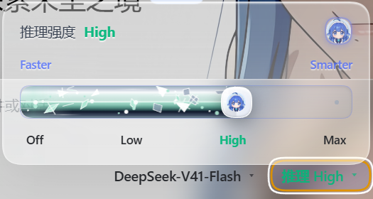
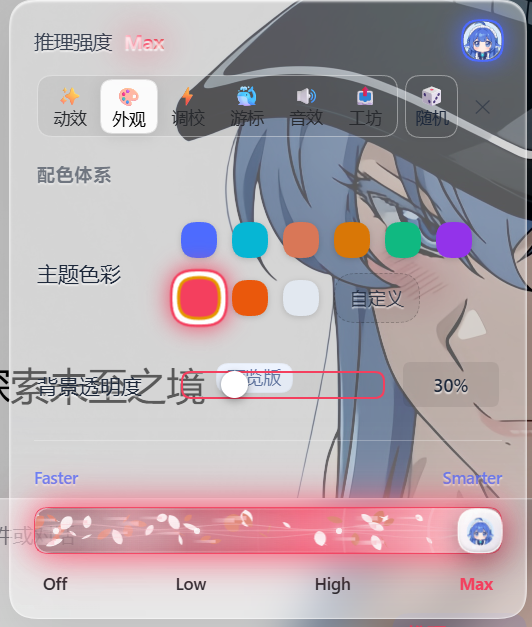
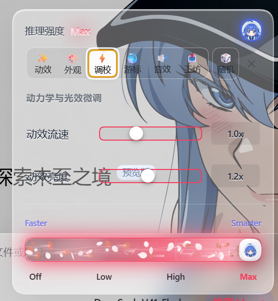
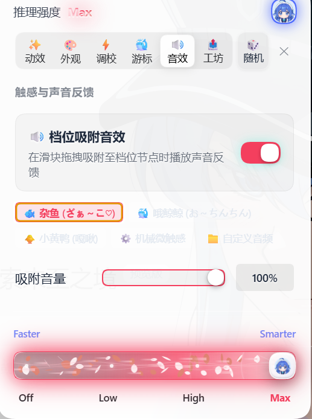
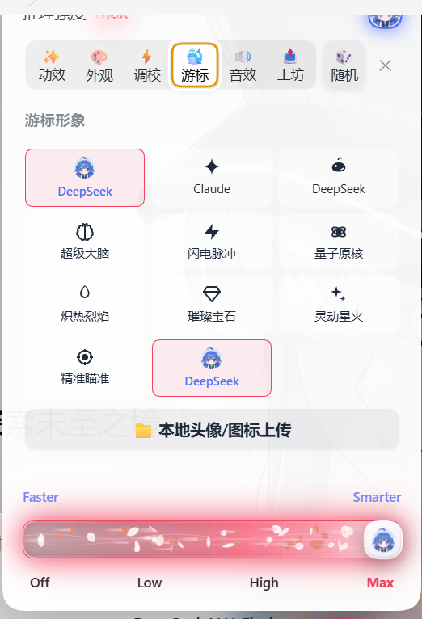

<div align="center">

# dsh-claude-slider

把 DeepSeek Harness 的「推理强度」下拉框，换成一条会呼吸的滑块。


</div>

拖动滑块即可在 Off / Low / Medium / High / Max 之间切换推理强度，并附带液态玻璃面板、Canvas 动效、主题配色与吸附音效。

---

## 界面实拍

<div align="center">



</div>

| 外观 · 配色与透明度 | 调校 · 流速与亮度 |
| :---: | :---: |
|  |  |
| **音效 · 吸附反馈** | **游标 · 图标选择** |
|  |  |

---

## 安装

```bash
# 桌面版（npm）
dsh plugin --profile desktop add dsh-claude-slider

# 网页版（npm）
dsh plugin --profile web add dsh-claude-slider

# 直接从 GitHub 安装
dsh plugin --profile desktop add github:yicun0316/dsh-claude-slider
```

装完在 DSH 客户端按 <kbd>Ctrl</kbd> + <kbd>R</kbd> 重新加载即可。

<details>
<summary>其他安装方式</summary>

**插件市场**：先装 `dshmarket`，再在界面内搜索 `dsh-claude-slider` 一键安装。

```bash
dsh plugin --profile desktop add dshmarket
```

**本地源码挂载**：克隆仓库 → 运行根目录 `install.bat`（自动软链接到 DSH 插件目录）→ `Ctrl + R`。
打开 `demo/index.html` 可离线预览完整功能。

**卸载**

```bash
dsh plugin --profile desktop remove dsh-claude-slider
```

</details>

---

## 特性

**滑块交互**　拖拽吸附换档，点击轨道节点直达，随时可关闭并还原为 DSH 原生下拉菜单。

**13 款动效**　随档位三阶递进解锁视觉层，而不是单纯的量变：

- 🚀 推进 — 火箭尾焰、超载折跃
- 🌊 流体 — 玻璃水银、火山喷发
- 🌸 幻境 — 落樱春水、极光织锦、深海鲸跃、萤火微光、落雪狂沙
- 💻 科技 — 频谱律动、雷达扫描
- 🎨 质感 — 星流碎钻、流金星河

> Low 出基础层，High 追加高光脊线与扫描线，Max 叠加泛光、能量射线与环绕火花；切入 Max 的瞬间还有一次径向冲击波。

**液态玻璃外观**　原生磨砂玻璃抽屉，10% ~ 100% 无级调节背景透明度；9 款预设主题色 + 原生 Hex 拾色器，动效与光晕跟随主题色联动。

**三轴调校**　流速、亮度、音量实时生效，一键复位。

**吸附音效**　杂鱼、哦鲸鲸、小黄鸭、机械微触感四款内置音，支持上传本地 MP3 / WAV（`assets/sounds/` 下可试听 `zako.mp3`、`ochinchin.mp3`）。

**游标图标**　10 款内置图标，也可上传 PNG / JPG / SVG 或直接填 Emoji。

**灵感搭配**　13 套策展组合随机抽取，采用洗牌袋机制——连点 13 次每款各出现一次，绝不重复。

**配置分享**　一键导出 JSON、粘贴导入，方便复制别人的搭配。

---

## 调校参数

| 参数 | 范围 | 默认 |
| :--- | :--- | :--- |
| 背景透明度 | 10% ~ 100% | 85% |
| 动效流速 | 0.5x ~ 2.0x | 1.0x |
| 动效亮度 | 0.5x ~ 2.0x | 1.0x |
| 吸附音量 | 0% ~ 100% | 100% |

---

## 目录结构

```
dsh-claude-slider/
├── package.json          # 插件信息与版本
├── cordis.patch.yml      # DSH 插槽声明
├── lib/
│   ├── index.js          # 服务端入口
│   └── client.js         # 客户端核心实现
├── assets/               # 面板截图、实机图、音频
├── demo/index.html       # 离线预览页
└── install.bat           # 本地软链接安装
```

配置保存在 `localStorage` 键 `dsh-claude-slider.config.v2`，插件零网络请求、不读写用户文件。

---

## 许可

[MIT](LICENSE) © yicun0316
